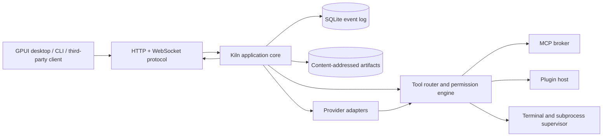
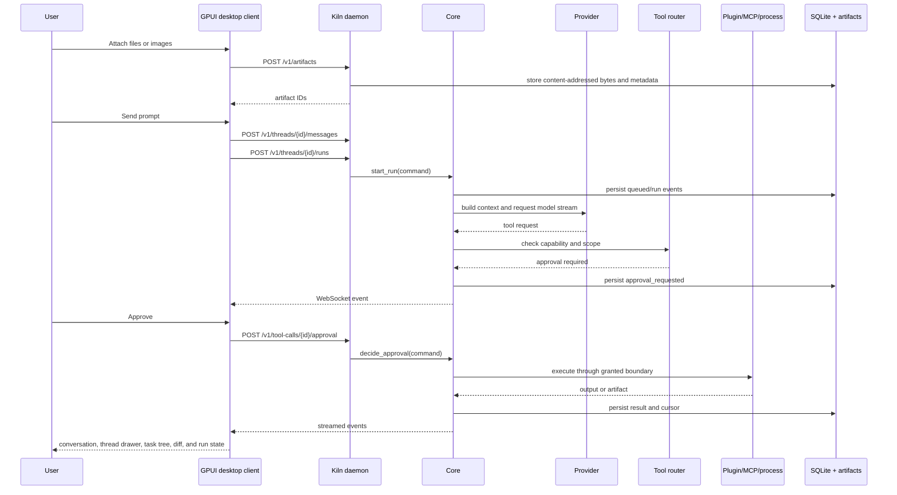

# Kiln product and architecture specification

Status: proposed product baseline

Date: 2026-08-14

This document defines what Kiln is, what the repository contains today, and
what the monorepo will become. It is the parent document for the
[core contract](core-contract.md),
[state machines](../architecture/state-machines.yaml),
[trust perimeter](../architecture/perimeter.md), HTTP contract, plugin
contract, and UI example.

## 1. Product definition

Kiln is a headless agentic development environment for work that spans more
than one repository. A user creates a project, adds repository roots, opens a
thread, and starts runs against that project. A run builds context, asks an
agent or model to act, requests permission for risky operations, executes
tools, and records the result as a durable event stream. A primary run can
delegate tasks to child runs. The user can see and steer that run tree without
leaving the parent conversation.

The core runs without a graphical environment. The native desktop client,
CLI, and third-party clients connect to the same versioned protocol. A later
web or mobile client can use that protocol without changing the core. The
client renders the work. The core owns state, permissions, processes,
persistence, and event delivery.

### Primary user

The first user is a developer who works across several related repositories,
for example an API, an edge service, and device firmware. The user needs to:

1. See the current state of agent work.
2. Understand which repositories and files a run can access.
3. Approve, reject, cancel, or resume work.
4. Inspect output, diffs, tests, terminals, and artifacts.
5. Reconnect without losing the event history.

The first client is for developers and operators. It is not a general chat
application and it is not an autonomous deployment system.

### Product promise

Kiln makes agent work inspectable and resumable. Every important action has a
state, a permission scope, and a durable event. The UI can disconnect without
destroying the run.

## 2. Current repository versus target product

The repository was reset after the first prototype. It now contains the
accepted planning documents, workspace boundaries, and an empty Rust
workspace. It contains no product implementation.

| Area | Current state | Target state |
| --- | --- | --- |
| Core | Contract only | Scheduler, context builder, task graph, permissions, and state transitions |
| Protocol | Planned OpenAPI and event schema under `docs/` | Validated source of truth with conformance fixtures |
| Persistence | No implementation and no accepted data schema | Versioned migrations, transactional lifecycle, cursors, and indexes |
| UI | Pencil and runnable static design examples only | Native Rust desktop client with GPUI first, then CLI and later protocol clients |
| Providers | No implementation | One deterministic provider and one direct provider |
| Plugins | Planned manifest and process protocol | External JSON-RPC plugins with explicit grants |
| MCP | Planned boundary only | Permissioned broker with one conformance server |
| Terminals | Planned state contract only | Scoped sessions with resize, attach, detach, and recovery |
| Editor and browser | No implementation | Later clients over explicit file and browser capabilities |
| Remote use | Explicitly disabled | Authentication and enrollment before remote deployment |

### What is already built

- Product, UI, protocol, plugin, and monorepo planning documents.
- A core operation and transaction contract.
- Machine-readable lifecycle definitions.
- A local first-release trust perimeter.
- A Rust workspace manifest without placeholder packages.

No behavior in these documents is implemented yet.

## 3. Scope boundaries

### In scope for the first product release

- Local daemon operation on macOS and Linux.
- One project with multiple local repository roots.
- Persistent threads, messages, runs, tasks, approvals, tool calls, and event
  replay.
- Parent and child runs, task assignment, queued guidance, explicit interrupt,
  and cancellation for subagent work.
- One direct model provider and one deterministic test provider.
- Permission-scoped file, process, Git, and terminal tools.
- Native desktop client for project, thread, run, approval, artifact, and
  terminal views.
- External plugin process boundary with a small capability model.
- MCP broker boundary with one tested server integration.

### Explicitly later

- Remote multi-user deployment and account management.
- Mobile-specific interaction design.
- A broad plugin marketplace.
- A general operating-system sandbox for arbitrary third-party code.
- Full IDE parity, browser automation catalog, and deployment automation.
- Multiple model providers before the provider interface is proven.

These boundaries keep the first release measurable. A plugin or provider is not
part of the core only because it can be started as a child process.

## 4. System shape



### Component responsibilities

| Component | Owns | Must not own |
| --- | --- | --- |
| `protocol` | Wire names, request/response shapes, event envelopes, capability names | Domain decisions or storage code |
| `core` | Domain entities, state transitions, application operations, permission decisions | HTTP, SQLx, provider SDK types, UI code |
| `adapters` | SQLite, artifacts, subprocesses, terminals, providers, plugin process IO | HTTP response formatting or product policy |
| `server` | HTTP/WebSocket extraction, authentication middleware, protocol conversion | Business logic or database queries outside application operations |
| `daemon` | Process composition, configuration, logging, startup, shutdown | Domain state transitions |
| `providers` | Provider-specific request/stream conversion | Provider types leaking into the core |
| `mcp` | MCP server lifecycle, discovery, result paging, cache, permission bridge | Direct UI state |
| `plugin-host` | Manifest validation, process lifecycle, JSON-RPC framing, capability grants | Implicit permissions |
| `client` | Typed HTTP/WebSocket transport shared by official Rust clients | Core imports, domain decisions, persistence |
| `desktop` | GPUI windows, navigation, rendering, local view state, user input, OS integration, secure local daemon launch | A second copy of the core domain or direct core calls |
| `cli` | Scriptable user interaction through the public protocol | A privileged shortcut into the core |

### Dependency rules

```text
clients ─────► protocol client types
server  ─────► protocol + core
daemon  ─────► server + adapters + core
adapters ────► core + protocol
providers ───► core provider traits
mcp ─────────► core tool traits + MCP wire types
plugin-sdk ─► protocol only
core ───────► protocol only
```

- The core does not import `server`, `adapters`, UI packages, provider SDKs, or
  database types.
- Internal application calls stay in-process. Do not add internal HTTP calls.
- The public protocol is independent of Rust.
- Provider-specific and plugin-specific types stop at their adapter boundary.
- A client can implement the language-neutral protocol in any language. The
  official Rust clients share the `client` crate. No client can bypass the
  protocol.

## 5. Technology stack

### Core and daemon

| Concern | Choice | Reason |
| --- | --- | --- |
| Language | Rust 2024 on the latest stable toolchain | Ownership and exhaustive state handling are useful for concurrent runs and process trees |
| Runtime | Tokio | Tasks, cancellation, child processes, sockets, timers, and signals |
| HTTP/WebSocket | Axum on Tower | Keeps transport handlers small and composes with standard middleware |
| Serialization | Serde and JSON | Cross-language protocol and durable payloads |
| Contract | OpenAPI 3.1.x plus JSON Schema 2020-12 | One language-neutral HTTP contract and reusable payload schemas |
| Metadata/event storage | SQLite through SQLx | Durable local operation with migrations and ordered events |
| Large content | Content-addressed artifact store | Keeps event messages small and makes results reusable |
| Diagnostics | `tracing` | Structured logs and run diagnostics |
| Terminal | An explicit PTY backend trait, with a portable implementation selected in the terminal phase | Keeps platform differences out of the application core |

Rust dependencies are selected when their implementation phase starts. Cargo
records the exact resolved versions in `Cargo.lock`. New dependencies require
a concrete boundary and a measurement or test that needs them.

### Native desktop client

| Concern | Choice | Reason |
| --- | --- | --- |
| Language | Rust 2024 on the latest stable toolchain | The client shares the repository toolchain without importing the core domain |
| Renderer and windowing | GPUI with `gpui_platform` | Native GPU rendering, window lifecycle, input, actions, and an application executor |
| Component foundation | `gpui-component` | Reusable inputs, lists, collapsibles, dialogs, Markdown, progress, themes, and resizable surfaces for an information-dense client |
| Product components | Kiln GPUI components | The transcript, composer, delegated Run, approval, and review surfaces have Kiln-specific behavior and visual rules |
| Client state | GPUI entities and views that project protocol state | The daemon event log stays canonical while views keep only local selection, draft, and presentation state |
| Transport | Shared Rust `client` crate over HTTP and WebSocket | The desktop and CLI clients use one protocol implementation and cannot call the core directly |
| Motion | GPUI animation primitives with an explicit reduced-motion mode | Motion explains streaming, expansion, upload, and Run state without a browser runtime |
| Terminal | A native GPUI terminal surface selected in the terminal phase | The client renders terminal output while the daemon owns PTY identity and IO |
| Tests | Rust unit and integration tests, `#[gpui::test]` interaction tests, and protocol-backed client tests | State projection, keyboard control, rendering behavior, and reconnect logic need direct tests |
| Packaging | Native application bundle plus a separate `kilnd` process | Closing the client does not stop active Runs, and the daemon remains usable headlessly |

Use `gpui-component` for general controls and interaction mechanics. Build the
Kiln transcript, composer, delegated Run, and review components before screen
instances. Apply Kiln design tokens instead of shipping the component gallery
theme unchanged.

The desktop client subscribes to the daemon event stream and projects ordered
events into GPUI entities. It must not add a domain cache that competes with
the core event log. It can discover or launch a local daemon, but all product
operations still cross the versioned HTTP/WebSocket boundary.

`assistant-ui` is no longer a runtime dependency. Its interaction examples can
remain design references, but Kiln implements streaming text, collapse and
reveal behavior, attachments, and Run activity as native GPUI components.

GPUI is pre-1.0 and can make breaking changes. Phase 2 selects the latest
stable compatible releases of GPUI, `gpui_platform`, and `gpui-component` as
one set. Cargo locks that set, and macOS and Linux client tests must pass before
an upgrade is accepted. Production builds do not use floating Git branches or
wildcard versions.

### CLI, plugins, MCP, and later clients

- **Desktop:** the Rust GPUI application owns windowing, notifications, file
  pickers, and secure local daemon launch. The Kiln daemon remains a separate
  process and remains usable without the desktop client.
- **CLI:** a Rust binary that uses the public protocol. It is an official
  client, not a privileged shortcut into `core`. It shares the Rust `client`
  crate with the desktop application.
- **Plugins:** external processes using JSON-RPC 2.0 over stdio first. A Rust
  `plugin-sdk` is a convenience package; the manifest and protocol allow other
  languages.
- **MCP:** a broker inside the daemon boundary. It speaks MCP to configured
  servers and converts selected tools into Kiln permission-checked tool calls.
- **Providers:** direct provider adapters and harness adapters implement one
  internal provider trait. Provider request, stream, and error types do not
  leave the adapter.
- **Later clients:** web and mobile clients can use the same HTTP/WebSocket
  contract. Their implementation stack is not selected in this release.

The stack choices follow the official documentation for
[GPUI](https://gpui.rs/),
[GPUI Component](https://longbridge.github.io/gpui-component/),
[Axum](https://docs.rs/axum/latest/axum/),
[OpenAPI](https://spec.openapis.org/oas/),
[JSON Schema](https://json-schema.org/specification), and
[MCP](https://modelcontextprotocol.io/specification/2024-11-05/index). The
implementation must re-check versions when each crate is added.

## 6. Target monorepo

The target tree is described in machine-readable form in
[`target-monorepo.yaml`](../architecture/target-monorepo.yaml).
Feature ownership and flow steps are in
[`feature-interactions.yaml`](../architecture/feature-interactions.yaml).
Core behavior is in [`core-contract.md`](core-contract.md). Lifecycle rules are
in [`state-machines.yaml`](../architecture/state-machines.yaml), and trust
boundaries are in [`perimeter.md`](../architecture/perimeter.md).

```text
kiln/
├── apps/
│   ├── desktop/             # Native Rust GPUI client
│   └── cli/                 # Official protocol client
├── crates/
│   ├── protocol/            # Wire types and conversions
│   ├── client/              # Shared Rust HTTP/WebSocket client
│   ├── core/                # Domain and application operations
│   ├── adapters/            # SQLite, artifacts, processes, terminals
│   ├── providers/           # Direct and harness provider adapters
│   ├── mcp/                 # MCP broker
│   ├── plugin-host/         # External plugin process boundary
│   ├── plugin-sdk/          # Rust plugin convenience layer
│   ├── server/              # HTTP and WebSocket transport
│   └── daemon/              # Composition and lifecycle
├── plugins/
│   ├── examples/            # Conformance fixtures
│   └── built-in/            # First-party plugins
├── schemas/
│   ├── data-model.schema.json
│   └── plugin-manifest.schema.json
├── protocol/
│   ├── openapi.yaml
│   ├── websocket.md
│   └── examples/
├── tests/
│   ├── conformance/         # Protocol and plugin fixtures
│   ├── integration/         # Real daemon tests
│   └── scenarios/           # Reusable product workflows
├── docs/
└── tools/
```

The empty `crates/` workspace will add these boundaries in dependency order.
Do not create an empty placeholder crate only to match the tree.

The contract files are stored under `docs/` during this planning phase. Phase
1 may move them to the root `protocol/` and `schemas/` directories after the
validation commands are in place. A move must preserve IDs, examples, and
compatibility rules.

## 7. Feature catalogue and interactions

| Feature | User outcome | Owner | Main inputs | Main outputs |
| --- | --- | --- | --- | --- |
| Project and roots | Work across several repositories in one context | `core` + `adapters` | root paths and labels | project records, root permission scopes |
| Threads | Keep work persistent and resumable | `core` + event log | messages and run events | ordered thread events |
| Run scheduler | Start, sequence, pause, cancel, and resume agent work | `core` | thread, agent, task graph | run state events |
| Task and subagent orchestration | Delegate bounded work and supervise it from the parent thread | `core` + `desktop` | parent run, task graph, child run input | child run tree, task progress, guidance and cancellation events |
| Context builder | Select instructions, files, history, and tool results | `core` + providers | roots, instructions, artifacts | provider request |
| Provider adapter | Stream model output and tool decisions | `providers` | normalized request | normalized model events |
| Permission engine | Make access explicit and reviewable | `core` | capability, scope, policy | allow, deny, approval request |
| Tool router | Execute a named capability through one path | `core` + `adapters` | tool call and grant | result or artifact |
| MCP broker | Discover and call external MCP tools safely | `mcp` | server config and search | normalized tool definitions/results |
| Plugin host | Extend tools without loading code into the daemon | `plugin-host` | signed/approved manifest | JSON-RPC result/events |
| Artifact store | Move large output out of events | `adapters` | bytes and media type | content hash and download route |
| Event stream | Show live progress and support reconnect | `server` + `core` | durable events and cursor | HTTP replay and WebSocket events |
| Terminal session | Let a client interact with a running shell | `adapters` + client | PTY input/resize | terminal output events |
| Agent workspace | Let a user converse with and steer agents | `desktop` | messages, protocol responses/events, artifacts | prompts, attachments, commands, approvals, navigation |

### End-to-end interaction



The UI sees events and sends commands. It does not infer that a run completed
from a missing WebSocket message; it confirms state through the event log or a
run query.

## 8. Data model

No persisted-data schema is accepted yet. It must follow the core operation and
state-machine contracts so it does not freeze an incomplete domain model. The
following relationships are design input, not an implementation contract:

```text
Project 1 ─── * WorkspaceRoot
Project 1 ─── * Thread
Thread  1 ─── * Message
Thread  1 ─── * Run
Run     1 ─── * child Run
Message * ─── * Artifact
Message * ─── 0..1 targeted Run
Run     1 ─── * Task
Task    1 ─── * child Task
Run     1 ─── * ToolCall
ToolCall 1 ─ * Approval
Run/ToolCall 1 ─ * Artifact
Thread  1 ─── * Event
```

Important rules:

- IDs are UUIDs and remain stable across daemon restart.
- Events are append-only and have a strictly increasing cursor per thread.
- Messages are user-visible content. Events are system history. They are not
  the same record.
- Large output is an `Artifact` reference, not an unbounded event payload.
- Files and images added in the composer are also `Artifact` records. A
  message references them by ID after upload completes.
- The persisted message keeps artifact IDs. The transcript API hydrates those
  IDs into attachment metadata so a client can render a name, media type,
  size, content hash, and image preview without an extra query per file.
- An uploaded file name is display metadata. It is never trusted as a local or
  server path.
- A `ToolCall` records capability, requested scope, decision, state, and result
  references.
- A `Run` records the selected agent, roots, task, provider, and terminal state
  needed for recovery.
- A child `Run` has one `parent_run_id`. The root run has no parent. All runs in
  one tree belong to the same thread.
- A `Task` can have a parent task, dependencies, and one assigned run. Task
  hierarchy is for presentation; dependency edges determine readiness.
- Guidance sent to a child run is a thread message with a target run. Queued
  delivery is the default. Interrupt delivery must be an explicit user action.
- A plugin request is never a permission grant. Grants are created by core
  policy and, when required, a user approval.

## 9. HTTP and WebSocket contract

[`openapi.yaml`](../protocol/openapi.yaml) is the planned HTTP source of truth.
The current server implements only the routes marked `current` in that file.

### Command and query groups

| Group | Endpoints | Use |
| --- | --- | --- |
| Capabilities | `GET /v1/health`, `GET /v1/capabilities` | Version and feature negotiation |
| Projects | `POST /v1/projects`, `GET /v1/projects/{id}`, `POST /v1/projects/{id}/roots` | Create and inspect multi-root work |
| Threads | `GET/POST /v1/projects/{id}/threads`, `GET /v1/threads/{id}`, `GET/POST /v1/threads/{id}/messages` | Thread drawer, persistent work records, transcript, and user input |
| Events | `GET /v1/threads/{id}/events?after={cursor}`, WebSocket `/v1/threads/{id}/stream` | Replay and live delivery |
| Runs | `GET/POST /v1/threads/{id}/runs`, `GET /v1/runs/{id}`, `POST /v1/runs/{id}/input`, `POST /v1/runs/{id}/cancel` | Root and child run lifecycle, supervision, and guidance |
| Tasks | `GET/POST /v1/threads/{id}/tasks`, `PATCH /v1/tasks/{id}`, `POST /v1/tasks/{id}/transition` | Explicit hierarchical work graph and guarded lifecycle |
| Approvals | `POST /v1/tool-calls/{id}/approval` | Allow or reject a requested operation |
| Artifacts | `POST /v1/artifacts`, `GET /v1/artifacts/{hash}` | Upload composer attachments and download artifact bytes |
| Extensions | `GET /v1/agents`, `GET /v1/providers`, `GET /v1/plugins`, `GET /v1/mcp/servers` | Inspect available execution boundaries |
| Lifecycle | `SIGINT`, `SIGTERM` | Graceful local daemon shutdown; an HTTP command remains deferred until local authentication exists |

Commands that create or start resources require an `Idempotency-Key` header.
The server returns the same resource for a repeated key in the same scope.
There is no compatibility form in a JSON request body. Phase 1 implements the
header form as the only accepted contract.

### WebSocket rules

1. The client connects with a thread ID and its last observed cursor.
2. The server sends durable events after that cursor before live events.
3. Events keep their original cursor and event ID.
4. A terminal stream is a typed event family, not an unbounded text socket.
5. If the client falls behind, it closes or replays from HTTP; it does not
   silently drop durable events.

The event envelope remains in
[`event-envelope.schema.json`](../architecture/event-envelope.schema.json)
until it is moved under the protocol source directory.

## 10. Plugin and MCP model

[`plugin-manifest.schema.json`](../plugins/plugin-manifest.schema.json) defines
the plugin installation request. The plugin protocol is documented in
[`plugin-protocol.md`](../plugins/plugin-protocol.md).

### Plugin lifecycle

1. Discover a manifest without starting the plugin.
2. Validate protocol version, executable, requested capabilities, and platform.
3. Show requested capabilities to the user or administrator.
4. Persist an explicit grant separate from the manifest request.
5. Start the process with a clean environment and framed JSON-RPC.
6. Route each call through the core permission engine.
7. Persist health, calls, errors, and shutdown state.

Plugins cannot read SQLite directly, inject events, or access a workspace root
without a grant. A plugin UI extension is a client package and has a separate
manifest. It cannot add arbitrary code to the daemon.

### MCP boundary

MCP servers are treated as external tool providers. The broker owns lifecycle,
health, discovery, search, result paging, artifact conversion, caching, and
permission checks. The model sees only the selected tool definitions and the
bounded result summary needed for the current decision.

## 11. UI product direction

The first client is the **Kiln Agent Workspace**. Its single job is to let a
developer converse with one coding agent while other work remains visible and
easy to resume.

The product model is conversation-first. It follows the interaction shape of
T3 Code and Codex, then adds selected workspace controls from Orca, Superset,
and Conductor. It is not a terminal wrapper and it is not an operations
dashboard.

The Pencil design `kiln.pen` is the component and screen source of truth. The
static example is [`kiln-workspace.html`](../ui/kiln-workspace.html). It is not
connected to the daemon and is only a portable interaction reference. Both
show the target information architecture:

- left edge: a 44-pixel project rail with project, worktree, active, and unread
  state only;
- temporary left drawer: thread search, active work, recent history, run state,
  branch or worktree, last activity, and New thread;
- center: the active conversation, with user messages, agent responses,
  approvals, task groups, subagent state, diffs, and compact tool activity in
  one readable stream;
- bottom of center: a persistent multiline composer with one attachment queue
  for picker, drop, and paste input;
- temporary right drawer: agents, changes, files, artifacts, preview, ports,
  and terminal; and
- top bar: active thread, repository branch or worktree, agent count, and
  changed-file count without a large page header.

The durable event log remains the source of truth for replay and recovery. The
client projects relevant events into compact conversation activity. Event IDs
and cursors remain available in details and diagnostics. They are not the main
reading order.

### Compact project rail and thread drawer

The thread drawer is navigation, not a central event ledger. The default order
is most recent activity first. A row shows title, project or worktree, time,
and one plain state such as working, needs input, done, or failed. Date groups
are a client projection from updated_at.

The persistent desktop rail is 44 logical pixels wide. The static example measures
a 30-pixel control with 7 pixels of space on each side. The rail shows project
or worktree marks, active state, unread state, new thread, and an expand
control. It does not show full thread titles.

Activating the rail or top-bar thread control opens a 248-pixel drawer over the
conversation. It does not change normal reading width. The static example fits
a 20-character title and short time label at this width. Search, active work,
recent history, thread titles, branches or worktrees, states, and times live in
the drawer. Selecting a thread or pressing Escape closes it. Kiln does not
offer a pinned drawer until GPUI interaction tests prove that a fixed
navigation column does not damage the conversation.

Selecting a row restores the transcript, latest durable cursor, composer
draft, attachment state, active run, and details selection. Search works on
thread titles and message text through the planned thread query contract.

### Conversation and activity

The central stream shows user and agent messages as the primary records. Tool
calls, commands, approvals, task progress, and generated artifacts appear
between messages at the point where they happened. Routine activity is one
compact row. Output, scope, event cursor, and errors expand on demand.

One task or workflow update renders as a compact inline group. Its header shows
the current objective and completed count. Its body shows completed, running,
blocked, and queued tasks in order. A running task shows its assigned agent,
current activity, worktree when isolated, and status text. Routine tool calls
fold behind `previous log entries`; they do not push the task summary away.

One small progress segment maps to one visible task. A one-pixel line connects
the task states and represents run lineage. It is not ornamental.

### Task and subagent supervision

The parent conversation is the control surface for delegated work. It does not
open one permanent column per agent.

- A root run can start child runs for tasks. Child runs can form a tree.
- The inline task group is live while any descendant is active. Completed
  groups stay collapsed but remain in the transcript.
- One concise subagent row in the transcript reports a spawn batch, for example
  Kicked off 2 subagents. Selecting it opens the temporary Agents drawer.
- The Agents drawer keeps stable three-line rows for identity, current
  activity, and metrics. Status updates do not reorder or resize a row.
- The drawer shows run lineage, agent and model, assigned task, worktree,
  recent activity, elapsed time, token usage when supplied by the provider,
  and the latest terminal state.
- `Focus` opens the child transcript in place and keeps a path back to the
  parent. `Guide` queues a targeted message. `Interrupt` sends the same message
  with explicit interrupt delivery. `Cancel` requests cancellation for only
  the selected run and its descendants.
- Task progress is derived from durable task and run events. The client does
  not mark a task complete because an animation finished or a socket became
  quiet.
- Parent and child activity uses the same approval, artifact, tool, and error
  components as a root run.

The interface can show a short model-provided reasoning summary. It must not
claim to expose hidden chain-of-thought content.

### Composer and attachments

The composer accepts text, files, and images in the same send action. A user
can add attachments with the picker, drag and drop, or paste. The picker does
not restrict selection to images.

Each attachment moves through `local`, `uploading`, `ready`, or `failed` in
client state. Image attachments show a thumbnail. Other files show name,
media type, and size. The send action waits until every retained attachment is
ready. A failed attachment remains visible with `Retry` and `Remove` actions.

The client uploads bytes and the owning thread ID with `POST /v1/artifacts`,
then sends returned artifact IDs in `POST /v1/threads/{id}/messages`.
Attachment-only messages are valid. Removing an attachment before send removes
it from the draft; artifact garbage collection is a separate storage concern.

No upload size limit is fixed in this planning phase. Phase 2 must measure the
real repository files used in protocol-backed client tests before it sets a
transport or storage tripwire.

### Temporary workspace details

Orca, Superset, and Conductor influence the optional tools, not the primary
conversation:

- isolated branch or worktree per independent task;
- parallel agent and task status, lineage, guidance, and cancellation;
- built-in diff review with comments sent back to the agent;
- files, artifacts, browser preview, ports, and terminal in one drawer; and
- review, merge, archive, or discard actions for each workspace.

The terminal is a tab in the details drawer. It is never the only way to read or
steer an agent.

### First client surfaces

| Surface | Job | Required API data |
| --- | --- | --- |
| Project rail and thread drawer | Keep other work visible; open navigation only to find or resume work | projects, thread query, run state, last activity |
| Conversation | Read prompts, responses, task groups, subagents, and inline activity | messages, event replay, run tree, tasks, tool calls |
| Composer | Send text with files or images | artifact upload, message creation, run creation |
| Approval card | Decide a risky operation in context | pending approval, capability, scope, preview |
| Changes drawer | Review agent edits and give feedback | workspace diff, files, annotations |
| Agents drawer | See and steer parallel work, dependencies, and run lineage | tasks, parent/child runs, agents, worktrees, targeted input |
| Artifact viewer | Inspect uploaded and generated content | artifact metadata and bytes |
| Terminal/preview tabs | Use development tools when needed | terminal events, ports, browser capability |
| Settings/integrations | Manage providers, MCP, and plugins | capability and installation endpoints |

## 12. Delivery plan

Each phase has a user-visible outcome and a proof gate. A phase is not complete
when its directories exist. It is complete when its contract, tests, and
documentation agree.

### Phase 0 — Contract and product baseline

This phase is the current work.

- publish this product/architecture specification;
- publish the target monorepo map;
- publish the core operation, state-machine, and trust-perimeter contracts;
- publish the OpenAPI, event, and plugin manifest contracts;
- publish the UI example and interaction map; and
- list current implementation versus target scope.

**Gate:** a new contributor can explain the product, locate each future
boundary, describe the first vertical slice, and identify every decision that
blocks that slice.

### Phase 1 — Protocol and core foundation

- validate the event contract and derive the persisted-data schema from the
  accepted core and state contracts;
- add OpenAPI validation and cross-language examples;
- implement the accepted transactional run creation and recovery rules;
- add parent/child run recovery, targeted run input, and task hierarchy rules;
- add explicit `Agent`, `Provider`, `Task`, `Message`, `Permission`, and
  `TerminalSession` operations;
- select and test the local HTTP and WebSocket authentication mechanism;
- replace free-form event type strings with a validated protocol event model;
- test the complete vertical slice against a real daemon and SQLite; and
- define the first provider trait with a deterministic provider fixture.

**Gate:** the desktop client can use only the public contract to create a
project, start a Run, receive or replay events, approve or cancel work, and
download an artifact after daemon restart.

### Phase 2 — Native desktop agent workspace

- create `apps/desktop` and the shared Rust `client` crate;
- select and lock one compatible GPUI, `gpui_platform`, and `gpui-component`
  release set;
- implement Kiln design tokens and reusable transcript, composer, delegated
  Run, approval, and review components before screen instances;
- implement the 44-pixel project rail, temporary thread drawer, and
  conversation stream;
- implement the multiline composer with file and image upload, paste, drag and
  drop, retry, and attachment-only messages;
- render durable run and tool events as expandable inline activity;
- render task groups and parent/child run state inline, with an Agents drawer
  for focus, guidance, interrupt, and cancellation;
- implement the temporary agents, changes, files, artifact, preview, ports, and
  terminal drawer;
- add local daemon discovery and secure launch without coupling the client to
  core domain code;
- validate Rust protocol types against the language-neutral contract; and
- add GPUI interaction and protocol tests against a real daemon fixture on
  macOS and Linux.

**Gate:** a developer can create or resume a thread, send a prompt with a file
and an image, follow and approve agent work, supervise at least two child runs,
send queued guidance to one child, cancel another, inspect the result, and
cancel the root run without curl or a Rust test client.

### Phase 3 — Provider, MCP, and plugin boundaries

- implement one direct provider adapter;
- implement one harness adapter as a compatibility path;
- implement the plugin host and Rust SDK;
- implement the MCP broker with one conformance server;
- add capability grants and plugin lifecycle events; and
- add failure, timeout, cancellation, and restart tests for each boundary.

**Gate:** a provider, MCP server, and external plugin can all produce a normal
Kiln tool call without special UI code.

### Phase 4 — Native development surfaces

- add OS notifications;
- add terminal attach/detach and PTY resize;
- add editor and Git review surfaces; and
- add browser control behind an explicit capability.

**Gate:** native development surfaces do not change core domain behavior or
the public protocol.

### Phase 5 — Remote and mobile operation

- extend local authentication with remote identity and enrollment;
- define daemon discovery and enrollment;
- add multi-user ownership and audit policy;
- add the review-first mobile client; and
- add deployment and operational documentation.

**Gate:** remote access has an explicit security model, recovery procedure, and
conformance tests. It is not enabled by merely binding the daemon to a public
address.

## 13. Decisions and unresolved work

The following decisions are now fixed for planning:

- OpenAPI plus JSON Schema is the protocol source of truth.
- The Rust GPUI desktop application is the first graphical client.
- GPUI and `gpui-component` replace React, Tauri, and assistant-ui in the
  first-release client.
- The desktop client uses the public HTTP/WebSocket protocol and does not
  import core domain code.
- Plugins use external JSON-RPC processes and explicit capability grants.
- MCP is a brokered tool-provider boundary.
- The UI consumes the protocol and event log; it does not own run state.
- Desktop project and worktree navigation is a 44-pixel rail with a temporary
  248-pixel thread drawer.
- Task groups and subagent state render inline. Detailed fleet controls use the
  temporary 328-pixel details drawer.
- `gpui-component` supplies general controls and interaction mechanics. Kiln
  owns the product-specific transcript, composer, delegated Run, review,
  persistence, scheduling, layout, and protocol state.

The following work still needs an implementation decision before its phase:

- terminal backend library and platform-specific PTY behavior;
- the GPUI-compatible terminal renderer;
- local authentication and remote enrollment;
- Git isolation strategy for concurrent repository work;
- first direct provider and its data-retention policy;
- whether client-specific UI extensions need a signed package format.

These are named decisions with owners and phase gates. They are not reasons to
add speculative code before the owning contract is accepted.

## 14. Completion checklist for the monorepo

- [x] Product definition and non-goals are documented.
- [x] Current code and target code are separated in the docs.
- [x] Target monorepo boundaries are machine-readable.
- [x] Core operations and transaction rules are documented.
- [x] State transitions are machine-readable.
- [x] The local trust perimeter is documented.
- [ ] Domain records have explicit schemas.
- [x] HTTP endpoints and WebSocket rules have a source of truth.
- [x] Plugin installation and capability grants have a schema.
- [x] Features have owners, inputs, outputs, and interaction paths.
- [x] UI information architecture has a runnable example.
- [x] Each delivery phase has a gate and a proof method.
- [x] Open decisions are named instead of hidden in implementation work.
